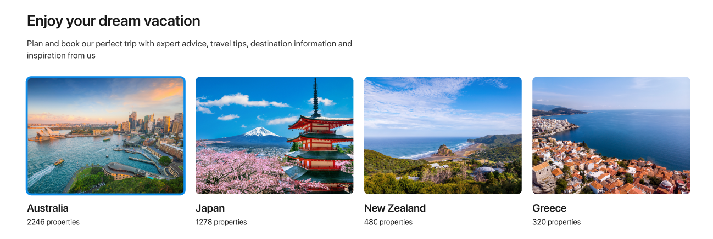

# Prakika

## context

1. I konteksta prideti prisijungusio userio id
2. issaugoti id kartu su email kai prisijungiama ar registruojamasi
3. UserTrips puslapyje panaudoti ta id ir parsisiusti keliones kurias sukure vartotojas
4. TripsPage atvaizduoti keliones kitokiu stilium jei tai prisijungusio vartotojo keliones

## back-end

1. Sukurti route GET /trips/user/id/1 ir gauti visas keliones kurias sukure vartotojas

## Countries Front end

1. /countries - CountriesPage.tsx - gauti visas salis ir atvaizduoti jas korteliu pavidalu 
2. /countries/:id - SingleCountryPage.tsx - gauti salies informacija ir atvaizduoti ja su stylingu
3. homepage ikelti sekcija kurioje bus keturios salys vienoje eiluteje kaip sekcija
4. jei truks back end routes, pasidaryti

## Back end

2. Delete trip route patikrinti ar vartotojas prisijunges ir ar jis yra savininkas ir tik tada istrinti kelione(prisideti i uzklausa kazka jei kazko truksta patikrinimui)
